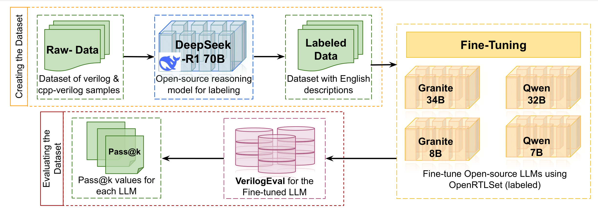

# OpenRTLSet: A Fully Open-Source Dataset for Large Language Model-based Verilog Module Design




## Content
* dataset_flow: source code for generating Raw-Data (Dataset of Verilog & C/C++ - Verilog Samples).
* LLM_flow: source code for running DeepSeek R1 70B labeling on Raw-Data to get Labeled Data (OpenRTLSet dataset), running finetuning on four open-source LLMs, and running VerilogEval to obtain pass@k metrics for each LLM.

## Environment Setup

We provide two sets of conda environments (ref: https://www.anaconda.com/docs/getting-started/main) that works with Anaconda and Miniconda:
- If you are on x86 CPU + A40/A100 GPU nodes:
  ```
  git clone https://github.com/UIUC-ChenLab/OpenRTLSet
  cd OpenRTLSet
  conda create -f LLM_flow/conda_env/a40-llm-env.yaml
  ```
- If you are on Grace Arm64 CPU + H100 GPU nodes:
  ```
  git clone https://github.com/UIUC-ChenLab/OpenRTLSet
  cd OpenRTLSet
  conda create -f LLM_flow/conda_env/gh200-llm-env.yml
  ```
Note: The conda environment of LLM_flow also covers the majority of the other flows' environments except some minor dependencies, please refer to the corresponding flow and update software environment accordingly (e.g., in dataset_flow/Verilator_Flow, Verilator installation is required in addition to the LLM_flow conda environment above).

## Link to Huggingface Dataset & finetuned LLMs
Our complete OpenRTLSet dataset is available at: https://huggingface.co/datasets/ESCAD/OpenRTLSet.
Our best fine-tuned LLM (Qwen2.5-Coder 32B) on our complete OpenRTLSet is available at: https://huggingface.co/ESCAD/Qwen2.5-Coder-32B-OpenRTLSet.

## Reference

Please cite our work if you find our code/paper is useful to your work.
```
@INPROCEEDINGS{Wang2025OpenRTLSet,
  author={Wang, Jinghua and Wan, Lily Jiaxin and Pingali, Sanjana and Smith, Scott and Jha, Manvi and Sivakumar, Shalini and Zhao, Xing and Cao, Kaiwen and Chen, Deming},
  booktitle={2025 IEEE International Conference on LLM-Aided Design (ICLAD)}, 
  title={OpenRTLSet: A Fully Open-Source Dataset for Large Language Model-based Verilog Module Design}, 
  year={2025},
  pages={212-218},
  doi={10.1109/ICLAD65226.2025.00038}
}
```
